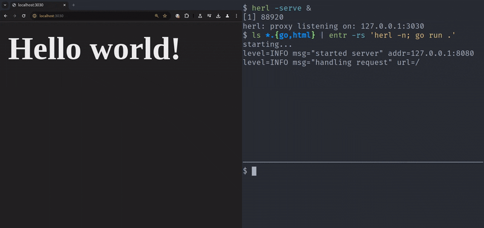

# herl

A minimal and scriptable way to refresh a webpage.

`herl` proxies requests to your website and injects a bit of javascript to
allow remote page refreshes. Because it is just an HTTP proxy it is compatible
with any backend language or framework.

Refreshes can be triggered with `herl -n` or by manually POSTing to `herl`s
notification endpoint. Of course you probably want to automate this by
integrating with your editor or an external file-watcher (the example directory
uses [entr][1] for generic on-save reloading).

In the below demo, because the index.html file is changed, `entr` calls
`herl -n` which refreshes the browser, and `go run .` which restarts the
application. While the application is building `herl` retries calling the
origin server a few times until a connection can be established, so the browser
only sees one refresh.

## Usage

 1. Start a proxy server with `herl -serve -origin https://example.com`.
 1. Open the default proxy server url (`http://127.0.0.1:3030`) in the browser. 
    This will show the content of `example.com`.
 1. Run `herl -notify` to refresh the page from the command line.

For all flags see: `herl -help`.

"Hot" or "live" reloading, as seen in modern frontend frameworks, can be
achieved by combining `herl` with, for example, [entr][1]. `entr` can be used
to execute a command when files change, see `example/makefile` for a working
example.

## Installation

Using the Go toolchain: `go install s14.nl/herl@latest`

From the AUR as `herl-bin`, so e.g. `yay -S herl-bin`

The [github releases page](https://github.com/SimonMTS/herl/releases) has downloads in the form of:
`.deb`, `.rpm`, and `.apk` packages, and plain binaries.

## Prior art

 * [templ live-reload](https://templ.guide/commands-and-tools/live-reload/),
   the main inspiration for this project. Because it is built specifically for
   use with templ, it is hard (if not impossible) to use on its own. Its scope
   is also much bigger than that of `herl`, it also includes the
   functionality of `entr`, for example.
 * [node-livereload](https://github.com/napcs/node-livereload), requires
   changing your code, or installing a browser extension.
 * [browser-sync](https://browsersync.io/), seemingly works in a similar way to
   `herl`, but has a lot more features and complexity. Written in node js.
 * `entr reload-browser`, doesn't seem to exist anymore, and worked by doing
   some x.org magic to refresh browser tabs, if I remember correctly.
 * [aarol/reload](https://github.com/aarol/reload), requires changing your
   code, and is mainly intended to be used as a Go middleware.

[1]: https://github.com/eradman/entr
